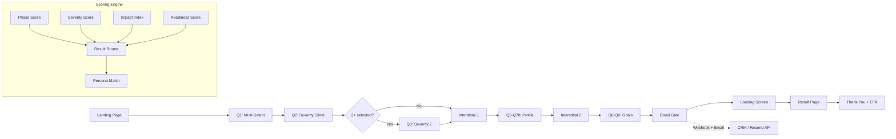

<p align="center">
  <h1 align="center">growth-quiz-engine</h1>
  <p align="center">
    Configurable quiz funnel engine with conditional branching, multi-axis scoring, personalized results, and email capture. Built for conversion.
  </p>
</p>

<p align="center">
  
  
  
  
  
  
</p>

<p align="center">
  <code>React 19 + TypeScript</code> · <code>Conditional Branching</code> · <code>40%+ Lead Conversion</code> · <code>PDF Reports</code>
</p>

---

<!--
## Demo

> **Live Demo:** [your-demo.vercel.app](https://your-demo.vercel.app)


-->

## Features

- **Configurable Questions** — Define questions, options, and flow via config files
- **Conditional Branching** — Show/skip questions based on previous answers
- **Multi-Axis Scoring** — 4-axis assessment engine (Phase, Severity, Impact, Readiness)
- **5 Result Personas** — Personalized results mapped to severity brackets
- **Personalized Email Reports** — HTML email with results, modules, and next steps
- **Email / Lead Capture** — Gated results with consent-aware lead collection
- **Mobile-First Design** — Touch-optimized, 48px targets, iOS zoom prevention
- **GA4 + Meta Pixel Ready** — Pre-built event tracking for full funnel analytics
- **A/B Testing** — Built-in variant support via URL parameter (`?variant=b`)
- **Exit Intent Modal** — Re-engagement for desktop users about to leave
- **Framer Motion Animations** — Smooth page transitions and micro-interactions

## Architecture



## Quick Start

```bash
# Clone the repository
git clone https://github.com/your-username/growth-quiz-engine.git
cd growth-quiz-engine

# Install dependencies
npm install

# Start development server
npm run dev
```

Open [http://localhost:5173](http://localhost:5173) to see the quiz.

## Project Structure

```
growth-quiz-engine/
├── src/
│   ├── lib/                    # Business logic & configuration
│   │   ├── constants.ts        # Brand config, quiz timing, A/B titles
│   │   ├── questions.ts        # Question definitions (9 questions)
│   │   ├── scoring.ts          # Multi-axis scoring engine
│   │   ├── results.ts          # Result type configs (5 personas)
│   │   ├── analytics.ts        # GA4 + Meta Pixel event tracking
│   │   └── webhook.ts          # CRM webhook + email API
│   ├── types/                  # TypeScript type definitions
│   ├── context/                # React Context (quiz state management)
│   ├── pages/                  # Screen components (18 screens)
│   │   ├── hero/               # Landing page sections
│   │   ├── Q1Concerns.tsx      # Multi-select concerns
│   │   ├── Q2Severity1.tsx     # Severity slider + frequency
│   │   ├── ResultScreen.tsx    # Personalized result page
│   │   └── ...
│   ├── components/
│   │   ├── ui/                 # shadcn/ui components
│   │   ├── quiz/               # Quiz-specific components
│   │   └── layout/             # Layout components
│   ├── hooks/                  # Custom React hooks
│   └── router/                 # Screen routing logic
├── api/
│   └── send-email.ts           # Vercel serverless email function
├── config/                     # Example configuration files
│   ├── questions.json          # Question definitions
│   ├── scoring.json            # Scoring rules
│   └── personas.json           # Result type configurations
├── docs/
│   └── customization.md        # Detailed customization guide
├── public/                     # Static assets
└── package.json
```

## Customization

### Questions

Edit `src/lib/questions.ts` to modify questions, options, and flow:

```typescript
export const QUESTIONS: QuestionConfig[] = [
  {
    id: 'primaryConcerns',
    screenId: 'q1-concerns',
    question: 'Which areas affect you the most?',
    type: 'multi',
    options: [
      { id: 'energy-fatigue', label: 'Energy & Fatigue', icon: 'Zap', emoji: '⚡' },
      // ... add your own options
    ],
  },
  // ... add more questions
]
```

### Scoring

Edit `src/lib/scoring.ts` to modify the 4-axis scoring engine:

- **Phase Score** (0-10) — Based on age + lifecycle phase
- **Severity Score** (0-44) — Weighted concern severity with frequency multipliers
- **Impact Index** — Raw average of severity sliders (low/medium/high)
- **Readiness Score** (0-14) — Assessment status + action readiness + current approach

### Result Personas

Edit `src/lib/results.ts` to customize the 5 result types:

```typescript
export const RESULT_TYPES: Record<ResultType, ResultTypeConfig> = {
  'mild-concerns': {
    headline: 'Mild Concerns Detected',
    subtitle: 'Your body is sending early signals...',
    actionModules: [
      { moduleRange: 'Module 1-3', title: 'Foundations', ... },
    ],
  },
  // ...
}
```

### Branding

Edit `src/lib/constants.ts` to change brand name, colors, and links:

```typescript
export const BRAND = {
  name: 'YourBrand',
  company: 'Your Company',
  tagline: 'Your tagline here.',
  // ...
}
```

Colors are configured in `tailwind.config.js` and `src/index.css`.

> See [docs/customization.md](docs/customization.md) for the full customization guide.

## Deployment

### Vercel (Recommended)

[](https://vercel.com/new/clone?repository-url=https://github.com/your-username/growth-quiz-engine)

1. Push to GitHub
2. Import in Vercel
3. Set environment variables:
   - `RESEND_API_KEY` — For email sending ([resend.com](https://resend.com))
   - `VITE_WEBHOOK_URL` — (Optional) CRM webhook endpoint

### Any Static Host

```bash
npm run build
# Deploy the `dist/` folder to any static host
```

> Note: The email API (`/api/send-email`) requires a serverless runtime (Vercel, Netlify Functions, etc.)

## Environment Variables

| Variable | Required | Description |
|----------|----------|-------------|
| `RESEND_API_KEY` | For emails | Resend API key for sending result emails |
| `VITE_WEBHOOK_URL` | Optional | CRM webhook endpoint for lead data |

Copy `.env.example` to `.env` and fill in your values.

## Tech Stack

| Technology | Purpose |
|-----------|---------|
| [React 19](https://react.dev) | UI framework |
| [TypeScript 5.9](https://typescriptlang.org) | Type safety |
| [Vite 7](https://vite.dev) | Build tool |
| [Tailwind CSS 3.4](https://tailwindcss.com) | Styling |
| [Framer Motion 12](https://motion.dev) | Animations |
| [Radix UI](https://radix-ui.com) | Accessible primitives |
| [Resend](https://resend.com) | Email delivery |
| [Zod 4](https://zod.dev) | Schema validation |
| [Vercel](https://vercel.com) | Hosting + serverless |

## Contributing

See [CONTRIBUTING.md](CONTRIBUTING.md) for guidelines.

## License

[MIT](LICENSE) — Dominik Tsatskin
